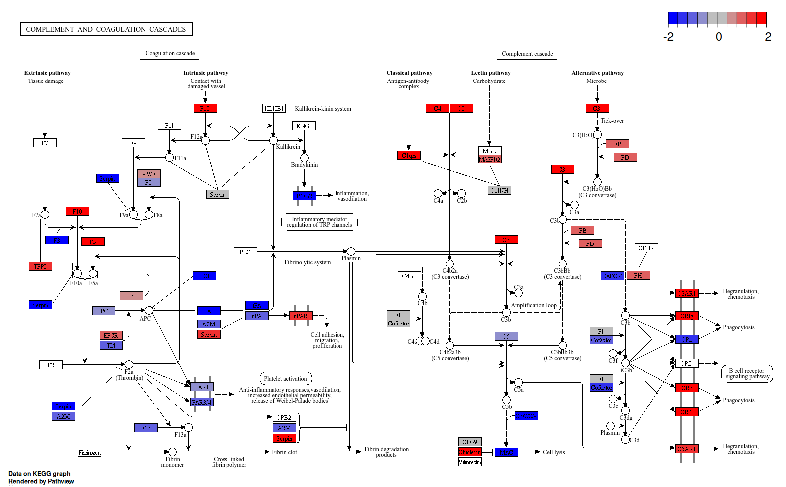

```{r setup, include=FALSE}
knitr::opts_chunk$set(
  warning = FALSE,
  message = FALSE
)
```

**Project Steps:**

1.  Selection of the disease: Kidney renal papillary cell carcinoma (KIRP)
2.  Differentially expressed genes (DEGs)
3.  CoExpression Networks
4.  Differential CoExpression Network
5.  Patient Similarity Network

```{r, results='hide'}
# TCGA-KIRP:
rm(list = ls())      # clear workspace
gc()                 # garbage collection
```

The first step is to loading the required packages for the analysis:

```{r message=FALSE}
library(BiocGenerics) # Contains Bioconductor generics used internally by SummarizedExperiment and DESeq2
library(DESeq2) # Store RNA-Seq counts and normalize counts
library(psych) # correlation analysis + p-value adjustment
library(NetworkToolbox) # Additional functions for network analysis
library(ggplot2) # volcano plot, degree distribution plot and any additional plot
# library(ggnet)    
library(GGally) # Package containing ggnet2(), essential function for plotting
library(sna) # functions for clustering coefficient, components..
library(network) # defines the network() object type
library(TCGAbiolinks) # queries the GDC portal and downloads TCGA data
library(GenomicRanges)  # Gene annotation is stored as GRanges
library(SummarizedExperiment)  # TCGA RNA-Seq is stored in a SummarizedExperiment object
library(DT)  # Interactive visualization
library(igraph)
library(maftools)
library(cowplot)
library(SNFtool)
library(reshape2)
library(poweRlaw)
# sessionInfo()
```

## 1. Download data

We proceed to download the required tumor RNA-Seq data (Primary Tumor)

```{r message=FALSE, results='hide'}
proj <- "TCGA-KIRP"
dir.create(file.path(proj))
```

RNA-Seq data: primary tumor samples

```{r message=FALSE}
rna.query.C <- TCGAbiolinks::GDCquery(
  project = proj,
  data.category = "Transcriptome Profiling",
  data.type = "Gene Expression Quantification",
  workflow.type = "STAR - Counts",
  sample.type = "Primary Tumor"
)
```

Download the data from GDC to local cache folder "GDCdata" a

```{r message=FALSE}
#GDCdownload(query = rna.query.C, directory = "GDCdata", method = "api")
```

Convert the downloaded files into a SummarizedExperiment object

```{r message=FALSE, results='hide'}
rna.data.C <- GDCprepare(rna.query.C, directory = "GDCdata")
```

Extract the raw count matrix (genes x tumor samples)

```{r message=FALSE}
rna.expr.data.C <- assay(rna.data.C)
```

Extract gene annotation (Ensembl IDs, gene symbols, chromosomes, etc.)

```{r message=FALSE}
genes.info <- BiocGenerics::as.data.frame(rowRanges(rna.data.C))
```

Checks:

```{r message=FALSE}
head(rna.query.C$results[[1]]$cases)
rna.data.C
dim(rna.expr.data.C)
head(genes.info)

```

Download normal samples

```{r message=FALSE}
# RNA-Seq data: solid tissue normal samples
rna.query.N <- TCGAbiolinks::GDCquery(
  project = proj,
  data.category = "Transcriptome Profiling",
  data.type = "Gene Expression Quantification",
  workflow.type = "STAR - Counts",
  sample.type = "Solid Tissue Normal"
)
```

Download normal data

```{r message=FALSE}
##GDCdownload(query = rna.query.N, directory = "GDCdata", method = "api")
```

Prepare SummarizedExperiment for normal samples

```{r message=FALSE, results='hide'}
rna.data.N <- GDCprepare(rna.query.N, directory = "GDCdata")
```

Extract raw counts for normal samples

```{r message=FALSE}
rna.expr.data.N <- assay(rna.data.N)
```

Extract gene annotation for normal dataset

```{r}
genes.info2 <- BiocGenerics::as.data.frame(rowRanges(rna.data.N))
```

Sanity check: tumor and normal gene annotations should match

```{r}
all(na.omit(genes.info2) == na.omit(genes.info))
```

Checks:

```{r}
dim(rna.expr.data.N)
rna.data.N
```

Results:

-   Tumor: 60,660 genes × 290 samples

-   Normal: 60,660 genes × 32 samples

-   Gene annotation: identical between tumor and normal

### Data cleaning

#### Inspect basic structure

Dimensions: genes x samples

```{r}
dim(rna.expr.data.C)  # tumor
dim(rna.expr.data.N)  # normal
```

Quick look at column names (TCGA barcodes)

```{r}
head(colnames(rna.expr.data.C))
head(colnames(rna.expr.data.N))
```

Extract patient IDs (first 12 characters of barcode)

```{r}
patients.C <- substr(colnames(rna.expr.data.C), 1, 12)
patients.N <- substr(colnames(rna.expr.data.N), 1, 12)
```

How many unique patients in each group?

```{r}
length(unique(patients.C))
length(unique(patients.N))
```

Distribution of tumor samples per patient (to detect duplicates)

```{r,results='hide'}
sort(table(patients.C))
```

#### Keep only patients with exactly ONE tumor sample

Table: how many tumor samples per patient

```{r}
tab.C <- table(patients.C)
```

Select patient IDs with exactly 1 primary tumor sample

```{r}
single.C <- names(tab.C[tab.C == 1])
```

Indices of columns in tumor matrix corresponding to single-sample patients

```{r}
idx.single.C <- which(patients.C %in% single.C)
```

Tumor expression matrix: only one tumor sample per patient

```{r}
expr.C <- as.data.frame(rna.expr.data.C[, idx.single.C])
```

Normal expression matrix: start with all normals

```{r}
expr.N <- as.data.frame(rna.expr.data.N)
```

#### Rename columns to pure patient IDs

Use only the 12-character patient ID as column names

```{r}
colnames(expr.C) <- substr(colnames(expr.C), 1, 12) 
colnames(expr.N) <- substr(colnames(expr.N), 1, 12)
```

quick check

```{r}
head(colnames(expr.C))
head(colnames(expr.N))
```

Make sure there are no duplicated column names now

```{r}
sum(duplicated(colnames(expr.C)))
sum(duplicated(colnames(expr.N)))
```

#### Keep only patients with BOTH tumor and normal samples

Patient IDs present in BOTH expr.C (tumor) and expr.N (normal)

```{r}
common_ids <- intersect(colnames(expr.C), colnames(expr.N))
length(common_ids) # this is the number of paired patients
```

Subset both matrices to the same set of patients

```{r}
expr.C <- expr.C[, common_ids, drop = FALSE] 
expr.N <- expr.N[, common_ids, drop = FALSE]
```

#### Remove genes with zero counts in ANY sample

We remove genes that have zero counts in at least one sample (tumor or normal) since they do not provide useful information for differential expression analysis and we aim to avoid mathematical issues during log fold change calculations.

```{r}
nonzero_genes <- rowSums(expr.C == 0) == 0 & rowSums(expr.N == 0) == 0

expr.C <- expr.C[nonzero_genes, ]
expr.N <- expr.N[nonzero_genes, ]

cat("Genes kept:", sum(nonzero_genes), "\n")

```

Sanity checks

```{r}
ncol(expr.C) # number of paired tumor samples 
ncol(expr.N) # number of paired normal samples 
all(colnames(expr.C) == colnames(expr.N)) # should be TRUE
```

#### Final technical checks on counts

Check that genes (rows) are aligned between tumor and normal

```{r}
all(rownames(expr.C) == rownames(expr.N)) # must be TRUE
```

Check data types and missingness

```{r}
typeof(expr.C[1, 1])            # should be "integer" or "double" 
any(is.na(expr.C))              # should be FALSE 
any(is.nan(as.matrix(expr.C)))  # should be FALSE

typeof(expr.N[1, 1]) 
any(is.na(expr.N)) 
any(is.nan(as.matrix(expr.N)))
```

At this point:

-   expr.C = raw tumor counts, genes x N_paired patients

-   expr.N = raw normal counts, genes x N_paired patients

-   Columns in expr.C and expr.N are the SAME patients, SAME order

These are the matrices we will feed into DESeq2 for normalization.

### Normalizing data with DESeq2

Check alignment of tumor and normal matrices

```{r}
all(rownames(expr.C) == rownames(expr.N)) # Must be TRUE (same gene order)
```

Combine into full dataset: normals first, then tumors

```{r}
full.data <- cbind(expr.N, expr.C) 
full.data <- data.frame(full.data)

dim(full.data) # should be 60660 x 64 (32 normal + 32 tumor)
```

### Build metadata

```{r}
metad <- data.frame( 
    condition = factor(c( 
        rep("normal", ncol(expr.N)), 
        rep("cancer", ncol(expr.C)) 
    )) 
)
```

Row names must match full.data column names

```{r}
rownames(metad) <- colnames(full.data)
```

DESeq2 expects gene_id as a column when tidy=TRUE

```{r}
full.data <- cbind(gene_id = rownames(full.data), full.data)
```

### Build DESeq2 dataset

```{r}
dds <- DESeqDataSetFromMatrix( 
    countData = full.data, 
    colData = metad, 
    design = ~ condition, 
    tidy = TRUE 
)
```

Sanity check

```{r}
dim(counts(dds)) # should be 60660 x 64
```

### Filter low-expression genes

At least 10 counts in 90% of **all** samples (32 normal + 32 cancer = 64 → 90% = 57)

```{r}
total_samples <- ncol(expr.N) + ncol(expr.C)  # 64
threshold <- floor(0.9 * total_samples)       # 57

cat("Total samples:", total_samples, "\n")
cat("Filtering threshold (90%):", threshold, "samples\n")

keep <- rowSums(counts(dds) >= 10) >= threshold
dds <- dds[keep, ]

cat("Genes before filtering:", nrow(full.data), "\n")
cat("Genes after filtering:", nrow(dds), "\n")
cat("Genes removed:", nrow(full.data) - sum(keep), "\n")
```

### Normalize using DESeq2 size factors

```{r}
dds <- estimateSizeFactors(dds)

normalized_counts <- counts(dds, normalized = TRUE)

# No gene should be zero in all samples
sum(rowSums(normalized_counts == 0) == ncol(normalized_counts))
```

### Split normalized matrix back into normal/tumor

```{r}
filtr.expr.n <- as.data.frame( 
    normalized_counts[, 1:ncol(expr.N)] 
)

filtr.expr.c <- as.data.frame( 
    normalized_counts[, (ncol(expr.N) + 1):ncol(normalized_counts)] 
)
```

Keep original patient IDs (DESeq2 sometimes adds .1, .2)

```{r}
colnames(filtr.expr.n) <- colnames(expr.N) 
colnames(filtr.expr.c) <- colnames(expr.C)
```

### Final checks

```{r,results='hide'}
# Same genes
all(rownames(filtr.expr.c) == rownames(filtr.expr.n))

# Same patients
all(colnames(filtr.expr.c) == colnames(filtr.expr.n))

nrow(filtr.expr.c)   # number of filtered/normalized genes
ncol(filtr.expr.c)   # should be 32

sizeFactors(dds)

```

```{r}
summary(sizeFactors(dds))
```

**Output:**

-   **filtr.expr.n = normalized expression for 32 normal samples**

-   **filtr.expr.c = normalized expression for 32 tumor samples**

These matrices are what we will use for:

-   DEGs

-   Volcano Plot

-   Co-expression networks

-   Differential networks

-   PSN and SNF

## 2. Differential Expression Analysis (DEGs)

### Compute log2 Fold Change

```{r}
log2fc <- log2(rowMeans(filtr.expr.c) / rowMeans(filtr.expr.n))
names(log2fc) <- rownames(filtr.expr.c)
```

### Compute paired t-test p-values

```{r}
pval <- sapply(
  1:nrow(filtr.expr.c),
  function(i) t.test(
    as.numeric(filtr.expr.c[i, ]),
    as.numeric(filtr.expr.n[i, ]),
    paired = TRUE
  )$p.value
)
```

### FDR correction

```{r}
pval_fdr <- p.adjust(pval, method = "fdr")
```

### Build DEG table

```{r}
deg.table <- data.frame(
  gene        = rownames(filtr.expr.c),
  log2FC      = log2fc,
  pvalue      = pval,
  pvalue_fdr  = pval_fdr,
  row.names   = rownames(filtr.expr.c)
)
```

### Apply thresholds

```{r}
FDR_threshold <- 0.05
FC_threshold  <- 2

deg.genes <- subset(
  deg.table,
  abs(log2FC) >= FC_threshold & pvalue_fdr <= FDR_threshold
)

cat("Number of DEGs:", nrow(deg.genes), "\n")
```

### Volcano plot

```{r}
deg.table$color <- "NO"
deg.table$color[deg.table$log2FC >= FC_threshold & deg.table$pvalue_fdr <= FDR_threshold] <- "UP"
deg.table$color[deg.table$log2FC <= -FC_threshold & deg.table$pvalue_fdr <= FDR_threshold] <- "DOWN"
deg.table$color <- factor(deg.table$color, levels = c("DOWN", "NO", "UP"))


base_theme <- theme_minimal(base_size = 20) +
  theme(
    plot.title = element_text(face = "bold", hjust = 0.5, size = 40),
    axis.title = element_text(size = 30),
    panel.grid.major = element_blank(),
    axis.text.x = element_text(size = 25),   
    axis.text.y = element_text(size = 25)
  )

ggplot(deg.table, aes(x = log2FC, y = -log10(pvalue_fdr), color = color)) +
  geom_point(alpha = 0.6, size = 5) +
  labs(
    title = "Volcano Plot of Differential Expression",
  ) +
  xlab("log2 Fold Change") +
  ylab("-log10 FDR") +
  geom_vline(xintercept = c(-FC_threshold, FC_threshold), col = "red") +
  geom_hline(yintercept = -log10(FDR_threshold), col = "red") +
  base_theme +
  theme(legend.position = "bottom", legend.title = element_text(size = 0, face = "bold"), legend.text = element_text(size = 30))


DEG_list <- rownames(deg.genes)
length(DEG_list)
```

## 3. Co-Expression Networks

### 3.1 Data Preparation

Extract DEG expression matrices and apply log transformation for correlation analysis.

```{r}
# Keep only DEGs in the normalized matrices
expr_deg_cancer <- filtr.expr.c[DEG_list, ]
expr_deg_normal <- filtr.expr.n[DEG_list, ]

# Log transform for correlation analysis
expr_deg_cancer <- log2(expr_deg_cancer + 1)
expr_deg_normal <- log2(expr_deg_normal + 1)

# Verify dimensions
cat("Expression matrix dimensions:\n")
cat(sprintf("  Cancer: %d genes × %d samples\n", nrow(expr_deg_cancer), ncol(expr_deg_cancer)))
cat(sprintf("  Normal: %d genes × %d samples\n", nrow(expr_deg_normal), ncol(expr_deg_normal)))
cat(sprintf("  Genes aligned: %s\n", all(rownames(expr_deg_cancer) == rownames(expr_deg_normal))))
```

### 3.2 Network Computation

Compute Pearson correlation matrices with FDR-adjusted p-values for both conditions.

```{r}
# Cancer correlation with FDR-adjusted p-values
cor.mat.c <- corr.test(
  t(expr_deg_cancer), 
  use = "pairwise",
  method = "pearson",
  adjust = "fdr",
  ci = FALSE
)

rho.c <- cor.mat.c$r
diag(rho.c) <- 0
qval.c <- cor.mat.c$p
qval.c[lower.tri(qval.c)] <- t(qval.c)[lower.tri(qval.c)]

# Normal correlation with FDR-adjusted p-values
cor.mat.n <- corr.test(
  t(expr_deg_normal), 
  use = "pairwise",
  method = "pearson",
  adjust = "fdr",
  ci = FALSE
)

rho.n <- cor.mat.n$r
diag(rho.n) <- 0
qval.n <- cor.mat.n$p
qval.n[lower.tri(qval.n)] <- t(qval.n)[lower.tri(qval.n)]
```

Build binary adjacency matrices using correlation and significance thresholds.

```{r}
# Define thresholds
corr_threshold_c <- 0.7   # Cancer correlation threshold
corr_threshold_n <- 0.8   # Normal correlation threshold (more stringent)
pval_threshold  <- 0.05  # FDR-adjusted p-value threshold

# Build binary adjacency matrices
adj_mat_c <- ((abs(rho.c) >= corr_threshold_c) & (qval.c <= pval_threshold)) * 1
adj_mat_n <- ((abs(rho.n) >= corr_threshold_n) & (qval.n <= pval_threshold)) * 1
```

```{r}
# Detailed network statistics
cat("\n=== CANCER NETWORK STATISTICS ===\n")
cat(sprintf("Total possible edges: %d\n", nrow(adj_mat_c) * (nrow(adj_mat_c) - 1) / 2))
cat(sprintf("Significant edges: %d\n", sum(adj_mat_c != 0) / 2))
cat(sprintf("Network density: %.4f\n", sum(adj_mat_c != 0) / (nrow(adj_mat_c) * (nrow(adj_mat_c) - 1))))
cat(sprintf("  - Positive correlations: %d\n", sum((adj_mat_c == 1) & (rho.c > 0)) / 2))
cat(sprintf("  - Negative correlations: %d\n", sum((adj_mat_c == 1) & (rho.c < 0)) / 2))

cat("\n=== NORMAL NETWORK STATISTICS ===\n")
cat(sprintf("Total possible edges: %d\n", nrow(adj_mat_n) * (nrow(adj_mat_n) - 1) / 2))
cat(sprintf("Significant edges: %d\n", sum(adj_mat_n != 0) / 2))
cat(sprintf("Network density: %.4f\n", sum(adj_mat_n != 0) / (nrow(adj_mat_n) * (nrow(adj_mat_n) - 1))))
cat(sprintf("  - Positive correlations: %d\n", sum((adj_mat_n == 1) & (rho.n > 0)) / 2))
cat(sprintf("  - Negative correlations: %d\n", sum((adj_mat_n == 1) & (rho.n < 0)) / 2))
```

### 3.3 Degree Analysis and Scale-Free Properties

Compute degree centrality for each network.

```{r}
# Compute degree for each network
degree_c <- colSums(adj_mat_c != 0)
names(degree_c) <- rownames(adj_mat_c)
degree_c <- sort(degree_c, decreasing = TRUE)

degree_n <- colSums(adj_mat_n != 0)
names(degree_n) <- rownames(adj_mat_n)
degree_n <- sort(degree_n, decreasing = TRUE)

# Summary statistics
cat("=== DEGREE DISTRIBUTION SUMMARY ===\n\n")
cat("Cancer Network:\n")
cat(sprintf("  Max degree: %d\n", max(degree_c)))
cat(sprintf("  Mean degree: %. 2f\n", mean(degree_c)))
cat(sprintf("  Median degree: %.1f\n", median(degree_c)))
cat(sprintf("  Nodes with degree > 0: %d (%.1f%%)\n", 
            sum(degree_c > 0), 100 * sum(degree_c > 0) / length(degree_c)))

cat("\nNormal Network:\n")
cat(sprintf("  Max degree: %d\n", max(degree_n)))
cat(sprintf("  Mean degree: %.2f\n", mean(degree_n)))
cat(sprintf("  Median degree: %.1f\n", median(degree_n)))
cat(sprintf("  Nodes with degree > 0: %d (%. 1f%%)\n", 
            sum(degree_n > 0), 100 * sum(degree_n > 0) / length(degree_n)))
```

#### Scale-Free Network Analysis

A scale-free network follows a power-law degree distribution. We check this by plotting log-log degree distributions.

```{r fig.width=10, fig.height=4}
par(mfrow = c(1, 2))

# Cancer Network
hist(degree_c, breaks = 50, main = "Cancer Network Degree Distribution",
     xlab = "Degree", col = "lightcoral", freq = FALSE)

# Normal Network
hist(degree_n, breaks = 50, main = "Normal Network Degree Distribution",
     xlab = "Degree", col = "lightgreen", freq = FALSE)

par(mfrow = c(1, 1))
```

```{r fig.width=10, fig.height=4}

# Function to estimate gamma using zeta free log-likelihood
estimate_gamma_zeta <- function(deg_freq, kmax = 100000) {
  # Build vector of observations from frequency table
  k_values <- as.numeric(names(deg_freq))
  k_counts <- as.numeric(deg_freq)
  
  # Expand into full sample vector
  k <- rep(k_values, k_counts)
  
  # Minimum degree
  k_min <- min(k)
  
  # Free zeta log-likelihood function
  loglik_zeta_free <- function(gamma, k, k_min, kmax) {
    if (gamma <= 1) return(-Inf)
    
    N <- length(k)
    M_prime <- sum(log(k))
    
    # Normalization constant (truncated zeta)
    Z <- sum(1 / (k_min:kmax)^gamma)
    
    if (!is.finite(Z) || Z <= 0) return(-Inf)
    
    # Log-likelihood
    -gamma * M_prime - N * log(Z)
  }
  
  # MLE fit
  result <- tryCatch({
    fit <- optim(
      par = 2.0,  # Initial gamma
      fn = function(gamma) -loglik_zeta_free(gamma, k, k_min, kmax),
      method = "Brent",
      lower = 1.01,
      upper = 10
    )
    
    gamma_hat <- fit$par
    ll <- -fit$value
    
    list(gamma = gamma_hat, loglik = ll, success = TRUE)
  }, error = function(e) {
    list(gamma = NA, loglik = NA, success = FALSE)
  })
  
  return(result)
}

par(mfrow = c(1, 2))


# Define consistent font sizes
main_cex  <- 1.2   # title size
lab_cex   <- 1.2   # axis label size
axis_cex  <- 1.0   # tick label size

# Cancer: Log-Log plot
deg_freq_c <- table(degree_c[degree_c > 0])
if (length(deg_freq_c) > 1) {
  # Estimate gamma using zeta MLE
  zeta_result_c <- estimate_gamma_zeta(deg_freq_c)
  gamma_c <- zeta_result_c$gamma
  
  # Plot
  plot(log10(as.numeric(names(deg_freq_c))), log10(as.numeric(deg_freq_c)), 
       main = "Cancer: Log-Log Degree Distribution", 
       xlab = "Degree", ylab = "Frequency", 
       pch = 16, col = "lightcoral", cex = 1.2,
       cex.main = main_cex, cex.lab = lab_cex, cex.axis = axis_cex)
  
  # Fit line for visualization (using estimated gamma)
  x_vals <- log10(as.numeric(names(deg_freq_c)))
  y_vals <- log10(as.numeric(deg_freq_c))

  fit_c <- lm(y_vals ~ x_vals)
  
  abline(fit_c, col = "darkred", lwd = 2, lty = 2)
  
  legend("topright", 
         legend = paste("γ (MLE) =", round(gamma_c, 2)),
         bty = "n", cex = 0.9)
}

# Normal: Log-Log plot
deg_freq_n <- table(degree_n[degree_n > 0])
if (length(deg_freq_n) > 1) {
  # Estimate gamma using zeta MLE
  zeta_result_n <- estimate_gamma_zeta(deg_freq_n)
  gamma_n <- zeta_result_n$gamma
  ll_n <- zeta_result_n$loglik
  
  # Plot
  plot(log10(as.numeric(names(deg_freq_n))), log10(as.numeric(deg_freq_n)), 
       main = "Normal: Log-Log Degree Distribution", 
       xlab = "Degree", ylab = "Frequency", 
       pch = 16, col = "lightgreen", cex = 1.2,
      cex.main = main_cex, cex.lab = lab_cex, cex.axis = axis_cex)
  
  # Fit line for visualization
  x_vals <- log10(as.numeric(names(deg_freq_n)))
  y_vals <- log10(as.numeric(deg_freq_n))
  
  # Linear regression for  calculation
  fit_n <- lm(y_vals ~ x_vals)
  
  abline(fit_n, col = "darkgreen", lwd = 2, lty = 2)
  
  legend("topright", 
         legend = paste("γ (MLE) =", round(gamma_n, 2)),
         bty = "n", cex = 0.9)
}

par(mfrow = c(1, 1))
```

### 3.4 Hub Identification and Comparison

Identify hubs as the top 5% of nodes with highest degree values.

```{r}
# Define hub thresholds (top 5% of connected nodes)
hub_threshold_c <- quantile(degree_c[degree_c > 0], 0.95)
hub_threshold_n <- quantile(degree_n[degree_n > 0], 0.95)

# Identify hubs
hubs_c <- degree_c[degree_c >= hub_threshold_c]
hubs_n <- degree_n[degree_n >= hub_threshold_n]

cat("=== HUB IDENTIFICATION ===\n")
cat(sprintf("Cancer Network:\n"))
cat(sprintf("  Hub threshold (95th percentile): degree ≥ %d\n", hub_threshold_c))
cat(sprintf("  Number of hubs: %d\n", length(hubs_c)))

cat(sprintf("\nNormal Network:\n"))
cat(sprintf("  Hub threshold (95th percentile): degree ≥ %d\n", hub_threshold_n))
cat(sprintf("  Number of hubs: %d\n", length(hubs_n)))
```

#### Hub Comparison Between Conditions

```{r}
# Compare hub sets
common_hubs <- intersect(names(hubs_c), names(hubs_n))
selective_hubs_c <- setdiff(names(hubs_c), names(hubs_n))
selective_hubs_n <- setdiff(names(hubs_n), names(hubs_c))

cat("=== HUB COMPARISON: CANCER vs NORMAL ===\n")
cat(sprintf("Common hubs (present in both): %d\n", length(common_hubs)))
cat(sprintf("Cancer-selective hubs: %d\n", length(selective_hubs_c)))
cat(sprintf("Normal-selective hubs: %d\n", length(selective_hubs_n)))
```

### 3.5 Gene Symbol Mapping

Map Ensembl IDs to gene symbols for biological interpretation.

```{r}
# Create gene mapping
gene_mapping <- genes.info[, c("gene_id", "gene_name")]
rownames(gene_mapping) <- gene_mapping$gene_id

get_gene_symbol <- function(ensembl_id, mapping = gene_mapping) {
  if (ensembl_id %in% rownames(mapping)) {
    symbol <- mapping[ensembl_id, "gene_name"]
    if (! is.na(symbol) && symbol != "") return(symbol)
  }
  return(ensembl_id)
}
```

#### Top 3 Hubs in Each Network

```{r}
# Top 3 Cancer Hubs
top3_cancer <- head(degree_c[degree_c > 0], 3)
top3_cancer_symbols <- sapply(names(top3_cancer), get_gene_symbol)

cat("=== TOP 3 HUBS: CANCER NETWORK ===\n\n")
for (i in 1:3) {
  cat(sprintf("%d. %s (%s) - Degree: %d\n", 
              i, top3_cancer_symbols[i], names(top3_cancer)[i], top3_cancer[i]))
}

# Top 3 Normal Hubs
top3_normal <- head(degree_n[degree_n > 0], 3)
top3_normal_symbols <- sapply(names(top3_normal), get_gene_symbol)

cat("\n=== TOP 3 HUBS: NORMAL NETWORK ===\n\n")
for (i in 1:3) {
  cat(sprintf("%d. %s (%s) - Degree: %d\n", 
              i, top3_normal_symbols[i], names(top3_normal)[i], top3_normal[i]))
}
```

### 3.6 Alternative Centrality Analysis (Betweenness)

Compare degree-based hubs with betweenness centrality to identify genes that serve as bridges.

```{r}
# Convert to igraph objects
graph_cancer <- graph_from_adjacency_matrix(adj_mat_c, mode = "undirected", diag = FALSE)
graph_normal <- graph_from_adjacency_matrix(adj_mat_n, mode = "undirected", diag = FALSE)

# Compute betweenness centrality
betweenness_c <- betweenness(graph_cancer, directed = FALSE, normalized = TRUE)
betweenness_n <- betweenness(graph_normal, directed = FALSE, normalized = TRUE)

names(betweenness_c) <- V(graph_cancer)$name
names(betweenness_n) <- V(graph_normal)$name

betweenness_c <- sort(betweenness_c, decreasing = TRUE)
betweenness_n <- sort(betweenness_n, decreasing = TRUE)
```

```{r}
# Identify top 5% by betweenness
bc_threshold_c <- quantile(betweenness_c[betweenness_c > 0], 0.95)
bc_threshold_n <- quantile(betweenness_n[betweenness_n > 0], 0.95)

top_bc_c <- betweenness_c[betweenness_c >= bc_threshold_c]
top_bc_n <- betweenness_n[betweenness_n >= bc_threshold_n]

# Compare with degree-based hubs
overlap_c <- intersect(names(top_bc_c), names(hubs_c))
overlap_n <- intersect(names(top_bc_n), names(hubs_n))

cat("=== DEGREE vs BETWEENNESS CENTRALITY COMPARISON ===\n")
cat("Cancer Network:\n")
cat(sprintf("  Degree hubs: %d | Betweenness hubs: %d | Overlap: %d (%.1f%%)\n",
            length(hubs_c), length(top_bc_c), length(overlap_c),
            100 * length(overlap_c) / length(union(names(hubs_c), names(top_bc_c)))))

cat("\nNormal Network:\n")
cat(sprintf("  Degree hubs: %d | Betweenness hubs: %d | Overlap: %d (%.1f%%)\n",
            length(hubs_n), length(top_bc_n), length(overlap_n),
            100 * length(overlap_n) / length(union(names(hubs_n), names(top_bc_n)))))
```

```{r fig.width=10, fig.height=5}
centrality_cancer_df <- data.frame(
  Gene = names(degree_c),
  Degree = as.numeric(degree_c),
  Betweenness = betweenness_c[names(degree_c)]
) %>%
  mutate(
    Hub_Type = case_when(
      Gene %in% overlap_c ~ "Both",
      Gene %in% names(hubs_c) ~ "Degree Only",
      Gene %in% names(top_bc_c) ~ "Betweenness Only",
      TRUE ~ "Non-Hub"
    ),
    Hub_Type = factor(Hub_Type, levels = c("Both", "Degree Only", "Betweenness Only", "Non-Hub"))
  )

centrality_normal_df <- data.frame(
  Gene = names(degree_n),
  Degree = as.numeric(degree_n),
  Betweenness = betweenness_n[names(degree_n)]
) %>%
  mutate(
    Hub_Type = case_when(
      Gene %in% overlap_n ~ "Both",
      Gene %in% names(hubs_n) ~ "Degree Only",
      Gene %in% names(top_bc_n) ~ "Betweenness Only",
      TRUE ~ "Non-Hub"
    ),
    Hub_Type = factor(Hub_Type, levels = c("Both", "Degree Only", "Betweenness Only", "Non-Hub"))
  )

my_colors <- c("Both" = "purple", "Degree Only" = "red",
               "Betweenness Only" = "blue", "Non-Hub" = "gray70")
legend_breaks <- names(my_colors)

# Plot 1: Cancer
p1 <- ggplot(centrality_cancer_df, aes(x = Degree, y = Betweenness, color = Hub_Type)) +
  geom_point(alpha = 0.5, size = 5) +
  scale_color_manual(
    values = my_colors,
    breaks = legend_breaks,
    limits = legend_breaks,
    drop = FALSE,
    name = "Hub Type"
  ) +
  labs(title = "Cancer Network", x = "Degree", y = "Betweenness") +
  base_theme +
  theme(legend.position = "none")  # legenda rimossa qui

# Plot 2: Normal
p2 <- ggplot(centrality_normal_df, aes(x = Degree, y = Betweenness, color = Hub_Type)) +
  geom_point(alpha = 0.7, size = 4) +
  scale_color_manual(
    values = my_colors,
    breaks = legend_breaks,
    limits = legend_breaks,
    drop = FALSE,
    name = "Hub Type"
  ) +
  labs(title = "Normal Network", x = "Degree", y = "Betweenness") +
  base_theme +
  theme(legend.position = "none")  # legenda rimossa qui

# Estrai la legenda da p1 (o p2, sono uguali per scala)
legend <- cowplot::get_legend(
  p1 + theme(legend.position = "bottom", legend.title = element_blank(), , legend.text = element_text(size = 30))
)

# Combina i due plot e la legenda centrata in basso
combined <- cowplot::plot_grid(
  cowplot::plot_grid(p1, p2, ncol = 2, align = "hv"),
  legend,
  ncol = 1,
  rel_heights = c(1, 0.12)  
)

# Aggiungi titolo globale
title <- ggdraw() + 
  draw_label("Degree vs Betweenness Centrality", fontface = "bold", hjust = 0.5, size = 40)

final_plot <- cowplot::plot_grid(title, combined, ncol = 1, rel_heights = c(0.15, 1))

final_plot
```

```{r}
# Correlation between centrality measures
cor_c <- cor(centrality_cancer_df$Degree, centrality_cancer_df$Betweenness, 
             method = "spearman", use = "complete.obs")
cor_n <- cor(centrality_normal_df$Degree, centrality_normal_df$Betweenness, 
             method = "spearman", use = "complete.obs")

cat("=== CENTRALITY CORRELATION ===\n")
cat(sprintf("Cancer Network (Spearman): %.3f\n", cor_c))
cat(sprintf("Normal Network (Spearman): %.3f\n", cor_n))
```

## 4. Differential Co-Expression Network

### 4.1 Network Computation

Compute differential co-expression using Fisher's Z-transform to identify edges with significantly changed correlations.

```{r}
# Sample sizes
n_c <- ncol(expr_deg_cancer)
n_n <- ncol(expr_deg_normal)

# Fisher's Z-transform
fisher_z <- function(r) {
  0.5 * log((1 + r) / (1 - r))
}

z_c <- fisher_z(rho.c)
z_n <- fisher_z(rho.n)

# Z-score for difference
se <- sqrt(1/(n_c - 3) + 1/(n_n - 3))
z_diff <- (z_c - z_n) / se

# Binary adjacency matrix
z_threshold <- 5  # |Z| >= 5 for significant differential co-expression
adj_mat_diff <- (abs(z_diff) >= z_threshold) * 1
diag(adj_mat_diff) <- 0

cat("=== DIFFERENTIAL NETWORK COMPUTATION ===\n\n")
cat(sprintf("Z-score threshold: |Z| ≥ %d\n", z_threshold))
cat(sprintf("Total possible edges: %d\n", nrow(adj_mat_diff) * (nrow(adj_mat_diff) - 1) / 2))
cat(sprintf("Differential edges: %d\n", sum(adj_mat_diff) / 2))
cat(sprintf("Network density: %.4f\n", sum(adj_mat_diff) / (nrow(adj_mat_diff) * (nrow(adj_mat_diff) - 1))))
```

### 4.2 Degree Analysis and Scale-Free Properties

```{r}
# Compute differential degree
degree_diff <- colSums(adj_mat_diff != 0)
names(degree_diff) <- rownames(adj_mat_diff)
degree_diff <- sort(degree_diff, decreasing = TRUE)

cat("=== DIFFERENTIAL NETWORK DEGREE SUMMARY ===\n")
cat(sprintf("Max degree: %d\n", max(degree_diff)))
cat(sprintf("Mean degree: %.2f\n", mean(degree_diff)))
cat(sprintf("Nodes with degree > 0: %d (%.1f%%)\n", 
            sum(degree_diff > 0), 100 * sum(degree_diff > 0) / length(degree_diff)))
```

```{r fig.width=10, fig.height=4}
par(mfrow = c(1, 2))

# Histogram
hist(degree_diff, breaks = 50, main = "Differential Network Degree Distribution",
     xlab = "Degree", col = "plum", freq = FALSE)

# Log-log plot
deg_freq_diff <- table(degree_diff[degree_diff > 0])
if (length(deg_freq_diff) > 1) {
  # Estimate gamma using zeta MLE (function defined earlier)
  zeta_result_diff <- estimate_gamma_zeta(deg_freq_diff)
  gamma_diff <- zeta_result_diff$gamma
  
  # Plot
  plot(log10(as.numeric(names(deg_freq_diff))), log10(as.numeric(deg_freq_diff)), 
       main = "Differential: Log-Log Degree Distribution", 
       xlab = "Degree", ylab = "Frequency", 
       pch = 16, col = "plum", cex = 1.2)
  
  # Fit line for visualization
  x_vals <- log10(as.numeric(names(deg_freq_diff)))
  y_vals <- log10(as.numeric(deg_freq_diff))
  
  # Linear regression for R² calculation
  fit_diff <- lm(y_vals ~ x_vals)
  
  abline(fit_diff, col = "purple", lwd = 2, lty = 2)
  
  legend("topright", 
         legend = c(paste("γ (MLE) =", round(gamma_diff, 2))), 
         bty = "n", cex = 0.9)
}

par(mfrow = c(1, 1))

```

### 4.3 Hub Identification and Comparison with Co-expression Networks

```{r}
# Identify differential hubs (top 5%)
hub_threshold_diff <- quantile(degree_diff[degree_diff > 0], 0.95)
hubs_diff <- degree_diff[degree_diff >= hub_threshold_diff]

cat("=== DIFFERENTIAL HUB IDENTIFICATION ===\n")
cat(sprintf("Hub threshold (95th percentile): degree ≥ %.2f \n", hub_threshold_diff))
cat(sprintf("Number of differential hubs: %d \n", length(hubs_diff)))
```

#### Compare with Task 3 Hubs

```{r}
# Compare differential hubs with cancer and normal hubs
common_diff_c <- intersect(names(hubs_diff), names(hubs_c))
common_diff_n <- intersect(names(hubs_diff), names(hubs_n))
selective_diff <- setdiff(names(hubs_diff), union(names(hubs_c), names(hubs_n)))

cat("=== COMPARISON: DIFFERENTIAL vs CO-EXPRESSION HUBS ===\n")
cat(sprintf("Differential hubs also in Cancer network: %d\n", length(common_diff_c)))
cat(sprintf("Differential hubs also in Normal network: %d\n", length(common_diff_n)))
cat(sprintf("Differential hubs unique (not hubs in either): %d\n", length(selective_diff)))
```

### 4.4 Top 3 Differential Hubs Analysis

```{r}
# Top 3 differential hubs
top3_diff <- head(degree_diff[degree_diff > 0], 3)
top3_diff_symbols <- sapply(names(top3_diff), get_gene_symbol)

cat("=== TOP 3 HUBS: DIFFERENTIAL NETWORK ===\n")
for (i in 1:3) {
  cat(sprintf("%d. %s (%s) - Differential Degree: %d\n", 
              i, top3_diff_symbols[i], names(top3_diff)[i], top3_diff[i]))
}
```

```{r}
cat("=== DETAILED CONNECTIVITY ANALYSIS ===\n")

top_diff_genes <- names(top3_diff)

for (i in 1:3) {
  gene <- top_diff_genes[i]
  symbol <- get_gene_symbol(gene)
  
  # Find neighbors in each network
  neighbors_n <- colnames(adj_mat_n)[adj_mat_n[gene, ] != 0]
  neighbors_c <- colnames(adj_mat_c)[adj_mat_c[gene, ] != 0]
  neighbors_diff <- colnames(adj_mat_diff)[adj_mat_diff[gene, ] != 0]
  
  # Calculate overlaps
  preserved <- intersect(neighbors_n, neighbors_c)
  lost <- setdiff(neighbors_n, neighbors_c)
  gained <- setdiff(neighbors_c, neighbors_n)
  
  # Z-score direction
  z_vals <- z_diff[gene, neighbors_diff]
  n_pos_z <- sum(z_vals > 0, na.rm = TRUE)
  n_neg_z <- sum(z_vals < 0, na.rm = TRUE)
  
  cat(sprintf("--- %d. %s ---\n", i, symbol))
  cat(sprintf("  Normal Degree: %d → Cancer Degree: %d (Change: %+d)\n", 
              degree_n[gene], degree_c[gene], degree_c[gene] - degree_n[gene]))
  cat(sprintf("  Differential Degree: %d\n", degree_diff[gene]))
  cat(sprintf("  Connections preserved: %d | Lost: %d | Gained: %d\n", 
              length(preserved), length(lost), length(gained)))
  cat(sprintf("  Edges with ↑ correlation in cancer: %d | ↓ correlation: %d\n", 
              n_pos_z, n_neg_z))
}
```

Create Comparison Table for Top 3 Differential Hubs

```{r}
# Identify the Top 3 genes from the Differential Network
top_diff_genes <- names(top3_diff)

# Build the comparison dataframe
comparison_table <- data.frame(
  Gene_Symbol = sapply(top_diff_genes, get_gene_symbol), # Convert Ensembl ID to Symbol
  Ensembl_ID = top_diff_genes,
  Degree_Normal = degree_n[top_diff_genes],              # Degree in Normal Network
  Degree_Cancer = degree_c[top_diff_genes],              # Degree in Cancer Network
  Degree_Differential = degree_diff[top_diff_genes]      # Degree in Differential Network
)

print(comparison_table) # Top 3 Differential Hubs
```

Visualization

```{r fig.width=8, fig.height=5}
plot_data <- data.frame(
  Gene = rep(comparison_table$Gene_Symbol, 2),
  Condition = rep(c("Normal", "Cancer"), each = 3),
  Degree = c(comparison_table$Degree_Normal, comparison_table$Degree_Cancer)
)
plot_data$Gene <- factor(plot_data$Gene, levels = comparison_table$Gene_Symbol)
plot_data$Condition <- factor(plot_data$Condition, levels = c("Normal", "Cancer"))

ggplot(plot_data, aes(x = Gene, y = Degree, fill = Condition)) +
  geom_bar(stat = "identity", position = "dodge", alpha = 0.8, width = 0.7) +
  geom_text(aes(label = Degree), position = position_dodge(width = 0.7), 
            vjust = -0.5, size = 10) +
  scale_fill_manual(values = c("Normal" = "#4DAF4A", "Cancer" = "#E41A1C")) +
  labs(title = "Top 3 Differential Hubs: Degree Comparison",
       x = "Gene Symbol", 
       y = "Degree") +
        base_theme + 
  theme(legend.position = "bottom",
        legend.title = element_text(size = 30, face = "bold"),
        legend.text = element_text(size = 30)
    )

```

### 4.5 Hub Transition Analysis

```{r}
# Full comparison for all differential hubs
all_diff_hub_genes <- names(hubs_diff)

full_comparison <- data.frame(
  Gene_Symbol = sapply(all_diff_hub_genes, get_gene_symbol),
  Ensembl_ID = all_diff_hub_genes,
  Degree_Normal = degree_n[all_diff_hub_genes],
  Degree_Cancer = degree_c[all_diff_hub_genes],
  Degree_Differential = degree_diff[all_diff_hub_genes],
  Is_Hub_Normal = all_diff_hub_genes %in% names(hubs_n),
  Is_Hub_Cancer = all_diff_hub_genes %in% names(hubs_c),
  stringsAsFactors = FALSE
)

full_comparison$Hub_Transition <- case_when(
  full_comparison$Is_Hub_Normal & full_comparison$Is_Hub_Cancer ~ "Hub in Both",
  full_comparison$Is_Hub_Normal & !full_comparison$Is_Hub_Cancer ~ "Lost Hub Status",
  !full_comparison$Is_Hub_Normal & full_comparison$Is_Hub_Cancer ~ "Gained Hub Status",
  TRUE ~ "Differential Hub Only"
)

full_comparison <- full_comparison[order(-full_comparison$Degree_Differential), ]

# Summary
transition_summary <- table(full_comparison$Hub_Transition)
cat("=== HUB TRANSITION SUMMARY ===\n")
print(transition_summary)
```

### 4.6 Subnetwork Visualization

#### Top Differential Hub Subnetwork

```{r fig.width=10, fig.height=8}
top_gene <- names(degree_diff)[1]
top_gene_symbol <- get_gene_symbol(top_gene)

neighbors_idx <- which(adj_mat_diff[top_gene, ] != 0)
neighbor_names <- colnames(adj_mat_diff)[neighbors_idx]
top_n <- 20
top_neighbors <- names(sort(degree_diff[neighbor_names], decreasing = TRUE))[1:min(top_n, length(neighbor_names))]

subnet_nodes <- unique(c(top_gene, top_neighbors))
subnet_adj <- adj_mat_diff[subnet_nodes, subnet_nodes]

g <- graph_from_adjacency_matrix(subnet_adj, mode = "undirected", diag = FALSE)
V(g)$label <- sapply(V(g)$name, get_gene_symbol)
V(g)$is_hub <- V(g)$name == top_gene

edge_list <- as_edgelist(g)
edge_signs <- sapply(1:nrow(edge_list), function(i) {
  node1 <- edge_list[i, 1]
  node2 <- edge_list[i, 2]
  z_val <- z_diff[node1, node2]
  if (z_val > 0) {
    return("Increased in Cancer")
  } else {
    return("Decreased in Cancer")
  }
})

E(g)$correlation_change <- edge_signs


set.seed(42)
ggraph(g, layout = "fr") +
  geom_edge_link(aes(color = correlation_change), alpha = 0.10, width = 0.8) +
  geom_node_point(aes(color = is_hub), size = 10, alpha = 0.9) +
  geom_node_text(aes(label = label), repel = TRUE, size = 10, max.overlaps = 20) +


  scale_edge_color_manual(
    values = c(
      "Increased in Cancer" = "#D81B60",
      "Decreased in Cancer" = "#1E88E5"
    ),
    name = "Correlation Change"
  ) +


  scale_color_manual(
    values = c(
      "FALSE" = "#b89ef4ff",
      "TRUE"  = "#ffcb8cff"
    ),
    labels = c("Neighbor", "Hub"),
    name = "Node Type"
  ) +

  theme_void() +
  ggtitle(paste0(top_gene_symbol, " Differential Subnetwork (Top ", top_n, ")")) +
  theme(
    plot.title = element_text(hjust = 0.5, face = "bold", size = 40),
    legend.position = "bottom",
    legend.text = element_text(size = 30),
    legend.title = element_text(size = 30, face = "bold"),
    legend.box = "vertical"

  )

```

### 4.7 Signed Differential Network Analysis

Distinguish between edges where correlations increased vs decreased in cancer.

```{r}
# Positive subnetwork (correlations INCREASED in cancer)
adj_mat_diff_positive <- (z_diff >= z_threshold) * 1
diag(adj_mat_diff_positive) <- 0

# Negative subnetwork (correlations DECREASED in cancer)
adj_mat_diff_negative <- (z_diff <= -z_threshold) * 1
diag(adj_mat_diff_negative) <- 0

cat("=== SIGNED DIFFERENTIAL NETWORK STATISTICS ===\n")
cat(sprintf("Positive edges (correlation ↑ in cancer): %d\n", sum(adj_mat_diff_positive) / 2))
cat(sprintf("Negative edges (correlation ↓ in cancer): %d\n", sum(adj_mat_diff_negative) / 2))
cat(sprintf("Ratio (Positive/Negative): %.2f\n", 
            sum(adj_mat_diff_positive) / max(sum(adj_mat_diff_negative), 1)))
```

```{r}
# Compute signed degrees
degree_positive <- colSums(adj_mat_diff_positive)
names(degree_positive) <- rownames(adj_mat_diff_positive)
degree_positive <- sort(degree_positive, decreasing = TRUE)

degree_negative <- colSums(adj_mat_diff_negative)
names(degree_negative) <- rownames(adj_mat_diff_negative)
degree_negative <- sort(degree_negative, decreasing = TRUE)

# Identify signed hubs
pos_threshold <- quantile(degree_positive[degree_positive > 0], 0.95)
neg_threshold <- quantile(degree_negative[degree_negative > 0], 0.95)

hubs_positive <- degree_positive[degree_positive >= pos_threshold & degree_positive > 0]
hubs_negative <- degree_negative[degree_negative >= neg_threshold & degree_negative > 0]

cat("=== SIGNED HUBS ===\n")
cat(sprintf("Positive hubs (correlations ↑ in cancer): %d\n", length(hubs_positive)))
cat(sprintf("Negative hubs (correlations ↓ in cancer): %d\n", length(hubs_negative)))
```

#### Top 3 Positive and Negative Hubs

```{r}
# Top positive hubs
top3_pos <- head(hubs_positive, 3)
top3_pos_symbols <- sapply(names(top3_pos), get_gene_symbol)

cat("=== TOP 3 POSITIVE HUBS ===\n")
cat("(Genes whose correlations INCREASED in cancer)\n")
for (i in seq_along(top3_pos)) {
  cat(sprintf("%d.  %s - Positive Degree: %d\n", i, top3_pos_symbols[i], top3_pos[i]))
}

# Top negative hubs
top3_neg <- head(hubs_negative, 3)
top3_neg_symbols <- sapply(names(top3_neg), get_gene_symbol)

cat("\n=== TOP 3 NEGATIVE HUBS ===\n")
cat("(Genes whose correlations DECREASED in cancer)\n")
for (i in seq_along(top3_neg)) {
  cat(sprintf("%d. %s - Negative Degree: %d\n", i, top3_neg_symbols[i], top3_neg[i]))
}
```

## 5. Patient Similarity Network (PSN)

### a. Computation of the PSN

#### Data preparation

We construct the Patient Similarity Network using normalized and log-transformed tumor expression data restricted to the DEGs.
Raw counts are not used, as highly expressed genes would dominate similarity estimates.

```{r}

target_data <- as.matrix(expr_deg_cancer)
```

Check dimension

```{r}
print(dim(target_data)) # we expect N_DEGs x 32 patients
```

#### Calculation of the similarity matrix

Calculate Pearson correlation between patients (columns)

```{r}
# Patient similarity matrix (patients x patients)
psn_full <- cor(target_data, method = "pearson")

```

#### Clean-up of the matrix

Set the diagonal to 0 to remove self-loops

```{r}
# Remove self-loops
diag(psn_full) <- 0

# Keep only positive similarities
psn_full[psn_full < 0] <- 0

# Sanity check
stopifnot(all(is.finite(psn_full)))
dim(psn_full)

```


```{r}
# Build graph from FULL similarity matrix
psn_graph <- graph_from_adjacency_matrix(
  psn_full,
  mode = "undirected",
  weighted = TRUE,
  diag = FALSE
)

# Louvain community detection
louvain_psn <- cluster_louvain(psn_graph)

# Community membership
comm_res <- data.frame(
  patient   = names(membership(louvain_psn)),
  community = as.character(membership(louvain_psn)),
  stringsAsFactors = FALSE
)

cat("Number of PSN communities:",
    length(unique(comm_res$community)), "\n")

```

We also apply a threshold to keep only the most significant edges

```{r}
###############################################################################
# Thresholded PSN — visualization only
###############################################################################

threshold_plot <- 0.7

psn_plot <- psn_full
psn_plot[psn_plot < threshold_plot] <- 0
diag(psn_plot) <- 0

cat("Edges shown in plot:", sum(psn_plot > 0) / 2, "\n")

```

#### Create the network object

```{r}
net_obj <- network(
  psn_plot,
  matrix.type = "adjacency",
  ignore.eval = FALSE,   # keep weights
  names.eval  = "weights",
  directed    = FALSE
)

# Attach community labels from FULL PSN clustering
net_names <- network.vertex.names(net_obj)
net_obj %v% "community" <-
  comm_res$community[match(net_names, comm_res$patient)]

```

#### Check of the graph

```{r}
cat("# of nodes (patients):", vcount(psn_graph), "\n")
cat("# of edges:", ecount(psn_graph), "\n")
```

Plot of the PSN

```{r}
# Define a manual color palette
pal <- c("1" = "#1f78b4",   # blue
         "2" = "#e31a1c")   # red

ggnet2(net_obj,
       color = "community",
       palette = pal,
       alpha = 0.9,
       size = 6,
       label = TRUE,
       label.size = 3,
       edge.color = "gray80",
       edge.alpha = 0.7,
       edge.size = 0.3) +
  ggtitle("Patient Similarity Network (Full PSN, thresholded for visualization)")


```


## 5. PSN USING NORMAL GENE EXPRESSION

Data preparation

```{r}
# Expression matrix: DEGs x patients (normal samples)
target_data_normal <- as.matrix(expr_deg_normal)

cat("Dimension NORMAL matrix (DEGs x Patients):\n")
print(dim(target_data_normal))

```

Similarity matrix calculation

```{r}
# FULL similarity matrix (patients x patients)
psn_normal_full <- cor(target_data_normal, method = "pearson")
# Remove self-loops
diag(psn_normal_full) <- 0

# Keep only positive similarities
psn_normal_full[psn_normal_full < 0] <- 0

# Sanity check
stopifnot(all(is.finite(psn_normal_full)))
dim(psn_normal_full)

```

As before, we also apply a threshold to keep only the most significant edges

```{r}
# Build graph from FULL similarity matrix
psn_graph_normal <- graph_from_adjacency_matrix(
  psn_normal_full,
  mode = "undirected",
  weighted = TRUE,
  diag = FALSE
)

# Louvain clustering
louvain_normal <- cluster_louvain(psn_graph_normal)

# Community membership
comm_res_normal <- data.frame(
  patient          = names(membership(louvain_normal)),
  community_normal = as.character(membership(louvain_normal)),
  stringsAsFactors = FALSE
)

cat("Number of communities (NORMAL):",
    length(unique(comm_res_normal$community_normal)), "\n")

```

Create the network object

```{r}
###############################################################################
# THRESHOLDED NETWORK — VISUALIZATION ONLY
###############################################################################

plot_thr <- 0.85

A_plot <- psn_normal_full
A_plot[A_plot < plot_thr] <- 0
diag(A_plot) <- 0

cat("Edges shown in plot:", sum(A_plot > 0) / 2, "\n")

```

Community detection with Louvain

```{r}
net_normal <- network(
  A_plot,
  matrix.type = "adjacency",
  ignore.eval = FALSE,
  names.eval = "weights",
  directed = FALSE
)

# Attach FULL community labels
net_names_norm <- network.vertex.names(net_normal)
net_normal %v% "community" <-
  comm_res_normal$community_normal[
    match(net_names_norm, comm_res_normal$patient)
  ]

```


```{r}
set.seed(77)
n_comm_norm <- length(unique(net_normal %v% "community"))

palette_norm <- c(
  "1" = "#1f78b4",
  "2" = "#33a02c",
  "3" = "#e31a1c"
)[seq_len(n_comm_norm)]

ggnet2(net_normal,
       color = "community",
       palette = palette_norm,
       alpha = 0.9,
       size = 6,
       label = TRUE,
       label.size = 3,
       edge.color = "gray85",
       edge.alpha = 0.8) +
  ggtitle("Patient Similarity Network — NORMAL (Full PSN, thresholded for visualization)")

```


Comparison between Tumor and Normal PSNs

```{r}
comparison_psn <- merge(comm_res, comm_res_normal, by = "patient")
colnames(comparison_psn) <- c("Patient", "Cancer_Community", "Normal_Community")
conf_mat_norm <- table(
  Cancer = comparison_psn$Cancer_Community,
  Normal = comparison_psn$Normal_Community
)
print("Confusion Matrix (Cancer vs Normal PSN):")
print(conf_mat_norm)
```

Heatmap of the confusion matrix

```{r}
melt_norm <- as.data.frame(as.table(conf_mat_norm))
colnames(melt_norm) <- c("Cancer_Group", "Normal_Group", "Count")

ggplot(melt_norm, aes(x = Normal_Group, y = Cancer_Group, fill = Count)) +
  geom_tile(color = "white") +
  geom_text(aes(label = Count), color = "black", size = 15) +
  scale_fill_gradient(low = "white", high = "steelblue") +
  labs(title = "Comparison: PSN Cancer vs PSN Normal",
       x = "Normal communities",
       y = "Cancer communities")   +
  guides(fill = guide_colourbar(
  barheight = unit(3, "in"),
  label.theme = element_text(size = 30),  
  title.theme = element_text(size = 0)    
)) +
  base_theme
```

## 5. Patient Similarity Network (PSN)

### c. Similarity Network Fusion

#### Download & Processing of Mutation Data

We download the Simple Nucleotide Variation data for TCGA-KIRP and convert it into a binary mutation matrix.

```{r message=FALSE}
query_mut <- TCGAbiolinks::GDCquery(
  project = proj, 
  data.category = "Simple Nucleotide Variation", 
  data.type = "Masked Somatic Mutation",
  workflow.type = "Aliquot Ensemble Somatic Variant Merging and Masking" # current standard 
)
```

Actual download **run only once**

```{r message=FALSE}
##GDCdownload(query = query_mut, directory = "GDCdata", method = "api")
```

Convert the downloaded files into a SummarizedExperiment object

```{r message=FALSE}
mut_data_prepared <- GDCprepare(query_mut)
```

Reading with maftools

```{r}
maf_obj <- read.maf(maf = mut_data_prepared)
```

Create the binary matrix (Patients x Genes)

```{r}
mut_count_matrix <- mutCountMatrix(maf_obj) # matrix with the count of the mutations
```

Transpose the matrix in order to have patients on the rows and genes on the columns

```{r}
mut_matrix_binary <- t(mut_count_matrix)
```

Convert in binary (1 if mutated, 0 otherwise)

```{r}
mut_matrix_binary[mut_matrix_binary > 0] <- 1
```

Use only the 12-character patient ID as row names

```{r}
rownames(mut_matrix_binary) <- substr(rownames(mut_matrix_binary), 1, 12)
```

Remove possible duplicates

```{r}
mut_matrix_binary <- mut_matrix_binary[!duplicated(rownames(mut_matrix_binary)), ]
```

#### Patient Alignment (Expression vs Mutation)

We need to ensure both matrices analyze exactly the same set of patients.

```{r}
patients_rna <- substr(colnames(target_data), 1, 12) # patients used in the 5a section (expression)
patients_mut <- rownames(mut_matrix_binary) # patients available in mutations
```

Find the intersection (common patients)

```{r}
common_patients <- intersect(patients_rna, patients_mut)
```

Quick check

```{r}
cat("Esempio RNA:", head(patients_rna, 3), "\n")
cat("Esempio MUT:", head(patients_mut, 3), "\n\n")

cat("Patients with RNA data:", length(patients_rna), "\n")
cat("Patients with Mutation data:", length(patients_mut), "\n")
cat("Common patients for SNF:", length(common_patients), "\n")
```

**That means that each patient of which we have the genic expression, has also a mutation**

Matrix reorder (both matrices must have columns in the same order):

```{r}
# Expression Matrix (must be Patients x Genes but in 5a the dim was Genes x Patients
# and SNF needs the patients on the rows)
data_expression <- t(target_data[, common_patients])

# Mutation Matrix (Patients x Genes)
data_mutation <- mut_matrix_binary[common_patients, ]
```

Final check

```{r}
all(rownames(data_expression) == rownames(data_mutation)) # Must be TRUE
```

#### Calculation of Affinity Matrices

Standard parameters for SNF

```{r}
K <- 20      # number of neighbors
alpha <- 0.5 # hyperparameter for the construction of the affinity kernel
T_iter <- 20 # number of iteration needed for the fusion
```

First Layer: Expression

```{r}
dist_exp <- dist2(as.matrix(data_expression), as.matrix(data_expression)) # Euclidean distance 
W_exp <- affinityMatrix(dist_exp, K, alpha) # Affinity Matrix (W1)
```

Second Layer: Mutation

```{r}
dist_mut <- dist2(as.matrix(data_mutation), as.matrix(data_mutation)) # Euclidean distance
W_mut <- affinityMatrix(dist_mut, K, alpha) # Affinity Matrix (W2)
```

Fusion (Similarity Network Fusion)

```{r}
W_fused <- SNF(list(W_exp, W_mut), K, T_iter)
```

Assign the patient's names to the fused matrix

```{r}
rownames(W_fused) <- common_patients
colnames(W_fused) <- common_patients
```

Same preprocessing as before

```{r}
# We're only interested in positive correlations
W_fused[W_fused<0] <- 0

# We also apply a threshold to keep only the most significant edges
threshold_snf <- 0
W_fused[W_fused < threshold_snf] <- 0

diag(W_fused) <- 0
```

#### Community Detection on the Fused Network

We apply Louvain clustering on the fused network to identify multi-omics communities.

Create the graph of the fused network:

```{r}
graph_snf <- graph_from_adjacency_matrix(W_fused, mode = "undirected", weighted = TRUE, diag = FALSE)
```

Apply Louvain

```{r}
louvain_snf <- cluster_louvain(graph_snf)
```

Create the dataframe of the SNF results

```{r}
comm_res_snf <- data.frame(
  patient = names(membership(louvain_snf)),
  community_snf = as.character(membership(louvain_snf)),
  stringsAsFactors = FALSE
)
```

Check

```{r}
cat("Number of communities found with SNF:", length(unique(comm_res_snf$community_snf)), "\n")
```

#### Plot of the Fused Network

Thresholding the matrix to improve readability

```{r}
#l_comp_snf <- W_fused
#threshold_snf <- 0.02
#l_comp_snf[l_comp_snf < threshold_snf] <- 0
#diag(l_comp_snf) <- 0
```

Network object

```{r}
###############################################################################
# THRESHOLDED SNF NETWORK (FOR VISUALIZATION ONLY)
###############################################################################

plot_thr_snf <- 0.02   # tipico per SNF (0.01–0.05)

A_snf_plot <- W_fused
A_snf_plot[A_snf_plot < plot_thr_snf] <- 0
diag(A_snf_plot) <- 0

cat("SNF plot edges:", sum(A_snf_plot > 0) / 2, "\n")

net_snf <- network(
  A_snf_plot,
  matrix.type = "adjacency",
  ignore.eval = FALSE,
  names.eval = "weights",
  directed = FALSE
)
```

Assign attributes

```{r}
net_names_snf <- network.vertex.names(net_snf)
net_snf %v% "community" <- comm_res_snf$community_snf[match(net_names_snf, comm_res_snf$patient)]

n_comm_snf <- length(unique(net_snf %v% "community"))
set.seed(123)
pal_snf <- sample(colors(distinct = TRUE), n_comm_snf)
names(pal_snf) <- sort(unique(net_snf %v% "community"))
```

Plot

```{r}
ggnet2(net_snf, 
       color = "community", 
       palette = pal_snf, 
       size = 6, 
       label = TRUE, 
       label.size = 3,
       edge.color = "gray80", 
       edge.alpha = 0.7) +
  ggtitle("SNF Community Structure (Expression + Mutation, thresholded)")
```

#### Final comparison

Merge the results into a single dataframe

```{r}
comparison_df <- merge(comm_res, comm_res_snf, by = "patient")
colnames(comparison_df) <- c("Patient", "Cluster_RNA_Only", "Cluster_SNF")
```

Create a Confusion Matrix to show how patients move among groups when adding mutation data

```{r}
conf_matrix <- table(RNA_Only = comparison_df$Cluster_RNA_Only, 
                     SNF = comparison_df$Cluster_SNF)

print("Confusion Matrix (Rows: RNA Clusters, Cols: SNF Clusters):")
print(conf_matrix)
```

Transform the table in a dataframe for the plot

```{r}
melted_cmat <- as.data.frame(as.table(conf_matrix))
colnames(melted_cmat) <- c("RNA_Group", "SNF_Group", "Count")
```

Plot

```{r}
ggplot(melted_cmat, aes(x = SNF_Group, y = RNA_Group, fill = Count)) +
  geom_tile(color = "white") +
  geom_text(aes(label = Count), color = "black", size = 10) +
  scale_fill_gradient(low = "white", high = "tomato") +
  labs(
    title = "Comparison: RNA-Seq vs SNF Clusters",
    x = "SNF Communities (RNA + Mutation)",
    y = "RNA-Only Communities (5.1)"
  ) +
  guides(fill = guide_colourbar(
  barheight = unit(3, "in"),
  label.theme = element_text(size = 30),   
  title.theme = element_text(size = 0)   
)) +
  base_theme

```

## PSN Communities Characterization (Clinical & Survival)

Stage 1 merges biological, clinical, and network-based information into a single patient-level table that will allow us to understand what defines each community and whether communities differ in survival or mutation patterns.

## 6. Clinical Data Integration

### Load libraries


## 3(opt). Gene Set Enrichment Analysis (cancer hubs)

### Load required libraries

```{r message=FALSE}
library(clusterProfiler)
library(org.Hs.eg.db)
library(enrichplot) # Useful for advanced visualizations
library(pathview)   # For visualizing colorful pathways
library(stringr)
```

### Prepare Data for Gene Ontology (GO)

We extract the gene symbols from the hubs identified in **Task 3**. We will compare "Cancer Hubs" (`hubs_c`) against "Normal Hubs" (`hubs_n`) to see the functional differences.

```{r}
genes_cancer <- names(hubs_c)
genes_normal <- names(hubs_n)
```

```{r}
head(genes_cancer)
head(genes_normal)
```

Remove the version suffix from the end of the IDs

```{r}
# gsub replaces the "\\..*" patter (the dot and all the rest) with ""
genes_cancer <- gsub("\\..*", "", genes_cancer)
genes_normal <- gsub("\\..*", "", genes_normal)
```

Let's see the type of the ID of the genes

```{r}
# Check of the the first gene to know its format
first_gene <- genes_cancer[1]
input_type <- ifelse(startsWith(first_gene, "ENSG"), "ENSEMBL", "SYMBOL")

cat("Clean ID:", genes_cancer[1], "\n")
cat("The genes appear to be in the format:", input_type, "\n")
```

Let's convert them in the **ENTREZ ID** format (better supported also for the KEGG later..)

```{r}
# Cancer Genes
entrez_cancer <- bitr(genes_cancer, 
                      fromType = input_type, 
                      toType = "ENTREZID", 
                      OrgDb = "org.Hs.eg.db")$ENTREZID

# Normal Genes
entrez_normal <- bitr(genes_normal, 
                      fromType = input_type, 
                      toType = "ENTREZID", 
                      OrgDb = "org.Hs.eg.db")$ENTREZID
```

Create a list for the compareCluster function

```{r}
hubs_list_entrez <- list(Cancer = entrez_cancer, Normal = entrez_normal)
```

Quick check

```{r}
head(hubs_list_entrez$Cancer)
head(hubs_list_entrez$Normal)
```

### Gene Ontology Enrichment (Biological Process)

We use `compareCluster` to perform GO enrichment for Biological Processes (`ont="BP"`). This allows us to visualize parallel functionalities between cancer and normal tissue hubs.

```{r}
# GO Analysis
comp_GO_BP <- compareCluster(geneCluster = hubs_list_entrez, 
                             fun = "enrichGO",
                             OrgDb = "org.Hs.eg.db",
                             keyType = "ENTREZID",
                             ont = "BP", 
                             pvalueCutoff = 0.05, 
                             pAdjustMethod = "BH",
                             readable = TRUE)
```

#### Plot

Visualize results with a DotPlot to see which biological processes the genes belong to

```{r}
# Simplify to reduce redundancy
comp_clean <- simplify(comp_GO_BP, cutoff = 0.6, by = "p.adjust", select_fun = min)

# Remove duplicate descriptions
comp_clean@compareClusterResult <- comp_clean@compareClusterResult[!duplicated(comp_clean@compareClusterResult$Description), ]

# Create readable plot
dotplot(comp_clean, 
      showCategory = 8, 
      title = "GO Enrichment: Biological Processes") +

scale_y_discrete(labels = function(x) str_wrap(x, width = 70)) + # Wrap text at 70 characters

theme(
  plot.title = element_text(hjust = 0.5, size = 12, face = "bold"),
  axis.text.y = element_text(size = 9, hjust = 1),  # Increase size slightly
  axis.text.x = element_text(angle = 45, hjust = 1, size = 10),
  plot.margin = margin(5, 5, 5, 5, "pt"))

```

Right column, Normal tissue: healthy tissue hubs are genes that maintain the physiological functionality of the kidney. The kidney serves to filter the blood and manage nutrients/salts; healthy hub genes do exactly that.

Left column, Cancer tissue: Instead, cancer hubs are predominantly enriched in processes related to immune response and inflammation. This suggests that the tumor microenvironment is characterized by a strong infiltration of immune cells and a chronic inflammatory state, which is a known feature of Papillary Renal Cell Carcinoma.

### KEGG Pathway Enrichment

```{r}
comp_KEGG <- compareCluster(geneCluster = hubs_list_entrez, 
                              fun = "enrichKEGG",
                              organism = "hsa",   # homo sapiens
                              pvalueCutoff = 0.05)
```

#### Plot

Plot to see which metabolic pathways the genes belong to

```{r}
dotplot(comp_KEGG, 
            showCategory = 10, 
            title = "KEGG Pathway Enrichment (Hubs)") +
      
      # Manda a capo i nomi dei pathway lunghi
      scale_y_discrete(labels = function(x) str_wrap(x, width = 50)) +
      
      theme(
        plot.title = element_text(hjust = 0.5, size = 12, face = "bold"),
        axis.text.y = element_text(size = 9), 
        axis.text.x = element_text(angle = 45, hjust = 1, size = 10),
        plot.margin = margin(10, 10, 10, 10)
      )
```

24/38 Cancer Genes and 19/27 Normal Genes were successfully mapped

Right column, Normal tissue: the related pathways confirm the metabolic nature of the healthy kidney. The kidney not only serves to filter, but actively reabsorbs proteins and sugars from the filtrate so as not to lose them in the urine. Normal hubs maintain this metabolic homeostasis.

Left column, Cancer tissue: conversely, the cancer network reveals a radical functional shift towards immune modulation and tissue remodeling. Dominant pathways like *Osteoclast differentiation* and *B cell receptor signaling* indicate a highly inflamed microenvironment. Cancer hubs no longer support filtration but rather drive structural changes and recruit immune cells to sustain tumor progression.

### Pathway Visualization

#### Data Preparation

We recover the log2fc calculated in Task 2

```{r}
gene_data_fc <- log2fc
```

Remove the version suffix from the end of the IDs (same as before)

```{r}
gene_names_clean <- gsub("\\..*", "", names(gene_data_fc))
```

Let's convert them in the **ENTREZ ID** format

```{r}
mapping_entrez <- bitr(gene_names_clean, 
                       fromType = input_type, # "SYMBOL" o "ENSEMBL" (computed before)
                       toType = "ENTREZID", 
                       OrgDb = "org.Hs.eg.db")
```

Create a final vector: VALUES = Log2FC, NAMES= EntrezID

```{r}
# We need to align the data: we only keep the genes that have been successfully converted
idx_mapped <- match(gene_names_clean, mapping_entrez[, input_type])
gene_data_entrez <- gene_data_fc[!is.na(idx_mapped)]
names(gene_data_entrez) <- mapping_entrez$ENTREZID[na.omit(idx_mapped)]
```

#### Pathway selection

```{r}
# We automatically search for the most significant pathway for the "Cancer" cluster
# if comp_KEGG has results:
if (!is.null(comp_KEGG) && nrow(comp_KEGG@compareClusterResult) > 0) {
  res_df <- as.data.frame(comp_KEGG)
  
  # we filter for the Cancer cluster
  top_cancer_pathway <- subset(res_df, Cluster == "Cancer")
  
  if (nrow(top_cancer_pathway) > 0) {
    # take the ID of the first pathway (es. hsa04060)
    path_id <- top_cancer_pathway$ID[1]
    path_name <- top_cancer_pathway$Description[1]
    
    cat("Map generation for the pathway:", path_name, "(", path_id, ")\n")
    
    # PATHVIEW EXECUTION
    pv.out <- pathview(gene.data = gene_data_entrez, 
                       pathway.id = path_id, 
                       species = "hsa", 
                       out.suffix = "cancer_hubs", # adds this name to the file
                       keys.align = "y", 
                       keb.dir = ".",      # saves the image in the current directory
                       limit = list(gene = 2, cpd = 1), # Color scale: from -2 (Blue) to +2 (Red)
                       low = list(gene = "blue"), 
                       mid = list(gene = "gray"), 
                       high = list(gene = "red"))
    
    cat("Image saved as:", paste0(path_id, ".cancer_hubs.png"), "\n")
    
  } else {
    cat("No cancer-specific pathways found in KEGG results.\n")
  }
}
```

#### Plot

Below there's an image because this library saves the plot as image within the main directory



This pathway indicates a shift towards chronic inflammation and tissue remodeling. Key components of the classical complement pathway, including the initiator **C1q** and the central hub **C3**, are upregulated (red nodes). Crucially, the strong upregulation of receptors such as **C5aR1**, **C3AR1**, and the integrin receptors **CR3/CR4** suggests active signaling for immune cell recruitment (chemotaxis) and adhesion, rather than direct cell lysis (as the terminal MAC complex remains downregulated). Furthermore, the upregulation of **uPAR** (PLAUR) and coagulation factors like **F10** and **F12** highlights a mechanism for extracellular matrix degradation and a pro-thrombotic state, facilitating tumor spreading and metastasis.

# PSN communities characterization

To address PSN community characterization in a statistically meaningful way, we adopted a tumor-only strategy, using all available primary tumor samples and retaining one tumor sample per patient. This choice allows us to substantially increase the number of patients included in the analysis, overcoming the severe sample size limitation that arises when restricting the cohort to paired tumor–normal samples only.

```{r}
###############################################################################
#  Tumor-only cohort: one Primary Tumor per patient
###############################################################################

# Raw tumor counts (genes x samples)
expr.C_all <- as.data.frame(rna.expr.data.C)

# Extract patient IDs (12 characters)
patients.C_all <- substr(colnames(expr.C_all), 1, 12)

# Count tumor samples per patient
tab.C_all <- table(patients.C_all)

# Keep only patients with exactly ONE tumor sample
single_patients_all <- names(tab.C_all[tab.C_all == 1])

# Subset expression matrix
idx.single.all <- which(patients.C_all %in% single_patients_all)
expr.C_all <- expr.C_all[, idx.single.all, drop = FALSE]

# Rename columns to pure patient IDs
colnames(expr.C_all) <- substr(colnames(expr.C_all), 1, 12)

# Final sanity checks
stopifnot(sum(duplicated(colnames(expr.C_all))) == 0)

cat("Tumor-only cohort (genes x patients):",
    nrow(expr.C_all), "x", ncol(expr.C_all), "\n")

```
```{r}
###############################################################################
#  Tumor-only normalization 

# Compute library sizes
lib_size <- colSums(expr.C_all)

# CPM normalization
tumor_norm <- sweep(expr.C_all, 2, lib_size, FUN = "/") * 1e6

# Log-transform
tumor_norm_log <- log2(tumor_norm + 1)


cat("Tumor-only normalized matrix:",
    nrow(tumor_norm_log), "genes x",
    ncol(tumor_norm_log), "patients\n")


```


```{r message=FALSE}

library(survival)
library(survminer)
library(maftools)
library(TCGAbiolinks)
library(stringr)
library(dplyr)
library(tidyr)
```


```{r, results='hide'}
query_clin <- GDCquery(
  project = proj,
  data.category = "Clinical",
  data.type = "Clinical Supplement",
  data.format = "BCR XML"
)

# Only run once (then comment)
##GDCdownload(query = query_clin)

clinical_kirp <- GDCprepare_clinic(query_clin, clinical.info = "patient")

```

```{r}
clinical_kirp <- clinical_kirp %>%
  dplyr::mutate(
    patient = bcr_patient_barcode,
    survival_time = ifelse(!is.na(days_to_death),
                           days_to_death,
                           days_to_last_followup),
    survival_status = ifelse(vital_status == "Dead", 1, 0)
  ) %>%
  dplyr::filter(!is.na(survival_time)) %>%
  dplyr::select(
    patient,
    survival_time,
    survival_status,
    age_at_initial_pathologic_diagnosis,
    gender
  )

head(clinical_kirp)
```


```{r}

DDR_genes  <- c("TP53", "ATM", "ATR", "BRCA1", "BRCA2", "CHEK1", "CHEK2")
TP53_path  <- c("TP53")
WNT_genes  <- c("APC", "CTNNB1", "AXIN1", "LRP5", "LRP6")
RTK_RAS_genes <- c("KRAS", "NRAS", "HRAS", "BRAF", "EGFR", "ERBB2")
PI3K_genes <- c("PIK3CA", "PTEN", "AKT1", "AKT2")

```

```{r}
DDR_genes      <- intersect(DDR_genes, colnames(mut_matrix_binary))
TP53_path      <- intersect(TP53_path, colnames(mut_matrix_binary))
WNT_genes      <- intersect(WNT_genes, colnames(mut_matrix_binary))
RTK_RAS_genes  <- intersect(RTK_RAS_genes, colnames(mut_matrix_binary))
PI3K_genes     <- intersect(PI3K_genes, colnames(mut_matrix_binary))
```

```{r}
pathway_matrix <- data.frame(
  patient = rownames(mut_matrix_binary),
  DDR      = as.integer(rowSums(mut_matrix_binary[, DDR_genes, drop = FALSE]) > 0),
  TP53     = as.integer(rowSums(mut_matrix_binary[, TP53_path, drop = FALSE]) > 0),
  WNT      = as.integer(rowSums(mut_matrix_binary[, WNT_genes, drop = FALSE]) > 0),
  RTK_RAS  = as.integer(rowSums(mut_matrix_binary[, RTK_RAS_genes, drop = FALSE]) > 0),
  PI3K     = as.integer(rowSums(mut_matrix_binary[, PI3K_genes, drop = FALSE]) > 0)
)

```

```{r}
# Compute TMB
tmb_res <- tmb(maf_obj)

# Convert data.table -> data.frame BEFORE dplyr
tmb_df <- as.data.frame(tmb_res) %>%
  dplyr::select(Tumor_Sample_Barcode, total_perMB) %>%
  dplyr::mutate(
    patient  = substr(Tumor_Sample_Barcode, 1, 12),
    TMB      = total_perMB,
    TMB_high = TMB > 10
  ) %>%
  dplyr::select(patient, TMB, TMB_high)


```

```{r}
clinical_kirp <- clinical_kirp %>%
  distinct(patient, .keep_all = TRUE)
clinical_kirp <- clinical_kirp %>% 
  filter(!is.na(survival_time), !is.na(survival_status))
```


```{r}
###############################################################################
# Alignment checks (RNA vs mutation vs clinical)
###############################################################################

patients_rna <- colnames(tumor_norm_log)
patients_mut <- rownames(mut_matrix_binary)
patients_clin <- clinical_kirp$patient

cat("RNA tumor patients:", length(patients_rna), "\n")
cat("Mutation patients:", length(patients_mut), "\n")
cat("Clinical patients:", length(patients_clin), "\n")

cat("RNA ∩ Mutation:",
    length(intersect(patients_rna, patients_mut)), "\n")
cat("RNA ∩ Clinical:",
    length(intersect(patients_rna, patients_clin)), "\n")

```
```{r}
###############################################################################
#  DEG panel availability in tumor-only cohort
###############################################################################

# DEG_list is already defined from paired analysis
length(DEG_list)

# Intersection with tumor-only expression matrix
DEG_list_all <- intersect(DEG_list, rownames(tumor_norm_log))

cat("DEGs from paired analysis:", length(DEG_list), "\n")
cat("DEGs available in tumor-only matrix:", length(DEG_list_all), "\n")

```

```{r}


X_tumor_deg <- tumor_norm_log[DEG_list, , drop = FALSE]

cat("Final PSN feature matrix:",
    nrow(X_tumor_deg), "genes x",
    ncol(X_tumor_deg), "patients\n")


```
```{r}


###############################################################################
# PSN (RNA-only, FULL)
###############################################################################

target_data_all <- as.matrix(X_tumor_deg)

psn_full <- cor(target_data_all, method = "pearson")
diag(psn_full) <- 0
psn_full[psn_full < 0] <- 0   # opzionale ma ok

stopifnot(all(is.finite(psn_full)))

cat("Full PSN:", dim(psn_full), "\n")


```
```{r}
###############################################################################
# Louvain on FULL PSN
###############################################################################

psn_graph_full <- graph_from_adjacency_matrix(
  psn_full,
  mode = "undirected",
  weighted = TRUE,
  diag = FALSE
)

louvain_psn_all <- cluster_louvain(psn_graph_full)

comm_res_psn_all <- data.frame(
  patient   = names(membership(louvain_psn_all)),
  community = as.character(membership(louvain_psn_all)),
  stringsAsFactors = FALSE
)

cat("Number of PSN communities:",
    length(unique(comm_res_psn_all$community)), "\n")


```
```{r}
###############################################################################
# PSN for visualization ONLY
###############################################################################

plot_thr <- 0.8

psn_plot <- psn_full
psn_plot[psn_plot < plot_thr] <- 0
diag(psn_plot) <- 0

cat("Edges for plot:", sum(psn_plot > 0) / 2, "\n")

```
```{r}
###############################################################################
# Network object for ggnet2
###############################################################################

net_psn_all <- network(
  psn_plot,
  matrix.type = "adjacency",
  ignore.eval = FALSE,
  names.eval = "weights",
  directed = FALSE
)

net_names <- network.vertex.names(net_psn_all)
net_psn_all %v% "community" <-
  comm_res_psn_all$community[match(net_names, comm_res_psn_all$patient)]


```
```{r}
###############################################################################
# Plot
###############################################################################

n_comm <- length(unique(net_psn_all %v% "community"))
set.seed(13)
pal <- sample(colors(distinct = TRUE), n_comm)
names(pal) <- sort(unique(net_psn_all %v% "community"))

ggnet2(net_psn_all,
       color = "community",
       palette = pal,
       alpha = 0.9,
       size = 5,
       label = FALSE,
       edge.color = "gray80",
       edge.alpha = 0.6,
       edge.size = 0.3) +
  ggtitle("PSN Communities (Full clustering, edges r > 0.8)")


```
```{r}
###############################################################################
# Patient alignment (RNA vs Mutation)
###############################################################################

patients_rna_all <- colnames(X_tumor_deg)
patients_mut <- rownames(mut_matrix_binary)

common_patients_all <- intersect(patients_rna_all, patients_mut)

cat("Patients RNA:", length(patients_rna_all), "\n")
cat("Patients Mutation:", length(patients_mut), "\n")
cat("Common patients for SNF:", length(common_patients_all), "\n")

```
```{r}
###############################################################################
# Prepare SNF input matrices
###############################################################################

# RNA view: patients x genes
data_expression_all <- t(X_tumor_deg[, common_patients_all, drop = FALSE])

# Mutation view: patients x genes
data_mutation_all <- mut_matrix_binary[common_patients_all, , drop = FALSE]

# Final check
stopifnot(all(rownames(data_expression_all) == rownames(data_mutation_all)))

cat("RNA view:", dim(data_expression_all), "\n")
cat("Mutation view:", dim(data_mutation_all), "\n")

```
```{r}
###############################################################################
# RNA affinity matrix
###############################################################################

dist_exp_all <- dist2(
  as.matrix(data_expression_all),
  as.matrix(data_expression_all)
)

W_exp_all <- affinityMatrix(dist_exp_all, K, alpha)

```

```{r}
###############################################################################
# Mutation affinity matrix
###############################################################################

dist_mut_all <- dist2(
  as.matrix(data_mutation_all),
  as.matrix(data_mutation_all)
)

W_mut_all <- affinityMatrix(dist_mut_all, K, alpha)


```
```{r}
###############################################################################
# Network fusion
###############################################################################

W_fused_all <- SNF(
  list(W_exp_all, W_mut_all),
  K,
  T_iter
)

rownames(W_fused_all) <- common_patients_all
colnames(W_fused_all) <- common_patients_all

# Remove self-loops
diag(W_fused_all) <- 0


W_fused_all[W_fused_all < 0] <- 0

```
```{r}
graph_snf_all <- graph_from_adjacency_matrix(
  W_fused_all,
  mode = "undirected",
  weighted = TRUE,
  diag = FALSE
)

louvain_snf_all <- cluster_louvain(graph_snf_all)

comm_res_snf_all <- data.frame(
  patient = names(membership(louvain_snf_all)),
  community_snf = as.character(membership(louvain_snf_all)),
  stringsAsFactors = FALSE
)

cat("Number of SNF communities:",
    length(unique(comm_res_snf_all$community_snf)), "\n")
```
```{r}
net_snf_all <- network(
  W_fused_all,
  matrix.type = "adjacency",
  ignore.eval = FALSE,
  names.eval = "weights",
  directed = FALSE
)

net_names <- network.vertex.names(net_snf_all)
net_snf_all %v% "community" <-
  comm_res_snf_all$community_snf[
    match(net_names, comm_res_snf_all$patient)
  ]
```
```{r}
###############################################################################
# Standardize patient IDs (12 chars) + deduplicate
###############################################################################

comm_res_snf_all$patient <- substr(comm_res_snf_all$patient, 1, 12)
clinical_kirp$patient    <- substr(clinical_kirp$patient, 1, 12)
pathway_matrix$patient   <- substr(pathway_matrix$patient, 1, 12)
tmb_df$patient           <- substr(tmb_df$patient, 1, 12)

clinical_kirp  <- clinical_kirp %>% distinct(patient, .keep_all = TRUE)
pathway_matrix <- pathway_matrix %>% distinct(patient, .keep_all = TRUE)
tmb_df         <- tmb_df %>% distinct(patient, .keep_all = TRUE)

###############################################################################
# Build master table (SNF + clinical + enrichment features)
###############################################################################

master_table_all <- comm_res_snf_all %>%
  rename(cluster_snf = community_snf) %>%
  left_join(clinical_kirp,  by = "patient") %>%
  left_join(pathway_matrix, by = "patient") %>%
  left_join(tmb_df,         by = "patient") %>%
  distinct(patient, .keep_all = TRUE)

cat("Patients in master table:", nrow(master_table_all), "\n")
cat("SNF clusters:", length(unique(master_table_all$cluster_snf)), "\n")
summary(master_table_all[, c("survival_time","survival_status")])

```
```{r}
###############################################################################
# Survival: Kaplan–Meier by SNF cluster
###############################################################################

surv_df <- master_table_all %>%
  filter(!is.na(survival_time), !is.na(survival_status), !is.na(cluster_snf)) %>%
  mutate(
    cluster_snf = factor(cluster_snf),
    survival_time = as.numeric(survival_time),
    survival_status = as.numeric(survival_status)
  )

cat("Patients usable for survival:", nrow(surv_df), "\n")
table(surv_df$cluster_snf)

km_snf <- survfit(Surv(survival_time, survival_status) ~ cluster_snf, data = surv_df)

ggsurvplot(
  km_snf,
  data = surv_df,
  palette = "Dark2",
  size = 1.3,
  censor.size = 3,
  pval = TRUE,
  conf.int = FALSE,
  xlab = "Time (days)",
  ylab = "Overall survival probability",
  legend.title = "SNF community",
  ggtheme = theme_classic(base_size = 15)
)
```
```{r}
###############################################################################
# Helper functions for enrichment tests
###############################################################################

# Robust Fisher test (fallback to simulation if needed)
safe_fisher <- function(tab) {
  out <- tryCatch(
    fisher.test(tab),
    error = function(e)
      fisher.test(tab, simulate.p.value = TRUE, B = 20000)
  )
  out$p.value
}

# Categorical enrichment (e.g. TMB_high, pathway mutation indicators)
cluster_enrichment_categorical <- function(df, cluster_col, var_col) {

  tmp <- df %>%
    dplyr::select(
      dplyr::all_of(cluster_col),
      dplyr::all_of(var_col)
    ) %>%
    dplyr::filter(!is.na(.data[[var_col]]))

  tab <- table(tmp[[cluster_col]], tmp[[var_col]])

  # Fisher test not defined if table has <2 rows or columns
  if (min(dim(tab)) < 2) {
    return(list(
      table = tab,
      p.value = NA
    ))
  }

  p <- safe_fisher(tab)

  list(
    table = tab,
    p.value = p
  )
}

# Continuous enrichment (e.g. TMB)
cluster_enrichment_continuous <- function(df, cluster_col, var_col) {

  tmp <- df %>%
    dplyr::select(
      dplyr::all_of(cluster_col),
      dplyr::all_of(var_col)
    ) %>%
    dplyr::filter(!is.na(.data[[var_col]]))

  # Kruskal–Wallis requires at least 2 groups
  if (length(unique(tmp[[cluster_col]])) < 2) {
    return(NA)
  }

  kruskal.test(tmp[[var_col]] ~ tmp[[cluster_col]])$p.value
}

```

```{r}
###############################################################################
#  Enrichment: TMB_high and pathway mutation indicators
###############################################################################

# TMB_high (categorical)
res_tmb_high <- cluster_enrichment_categorical(master_table_all, "cluster_snf", "TMB_high")
res_tmb_high$table
cat("Enrichment p-value (TMB_high):", res_tmb_high$p.value, "\n")

# TMB (continuous)
p_tmb <- cluster_enrichment_continuous(master_table_all, "cluster_snf", "TMB")
cat("Kruskal p-value (TMB):", p_tmb, "\n")

# Pathway indicators (categorical 0/1)
path_vars <- c("DDR","TP53","WNT","RTK_RAS","PI3K")
path_vars <- path_vars[path_vars %in% colnames(master_table_all)]

enrich_path <- lapply(path_vars, function(v) {
  out <- cluster_enrichment_categorical(master_table_all, "cluster_snf", v)
  data.frame(variable = v, p.value = out$p.value)
})

enrich_path_df <- do.call(rbind, enrich_path) %>%
  mutate(p.adj = p.adjust(p.value, method = "fdr")) %>%
  arrange(p.adj)

enrich_path_df

```

```{r}
###############################################################################
#  Clinical enrichment: age + gender
###############################################################################

# Age
if ("age_at_initial_pathologic_diagnosis" %in% colnames(master_table_all)) {
  p_age <- cluster_enrichment_continuous(master_table_all, "cluster_snf", "age_at_initial_pathologic_diagnosis")
  cat("Kruskal p-value (age):", p_age, "\n")
}

# Gender
if ("gender" %in% colnames(master_table_all)) {
  res_gender <- cluster_enrichment_categorical(master_table_all, "cluster_snf", "gender")
  res_gender$table
  cat("Enrichment p-value (gender):", res_gender$p.value, "\n")
}

```
```{r}
###############################################################################
# Prepare expression + metadata for community DE
###############################################################################

# Ensure same patients
common_patients <- intersect(
  colnames(tumor_norm_log),
  comm_res_snf_all$patient
)

expr_comm <- tumor_norm_log[, common_patients, drop = FALSE]

meta_comm <- comm_res_snf_all %>%
  filter(patient %in% common_patients) %>%
  mutate(community_snf = factor(community_snf)) %>%
  arrange(match(patient, common_patients))

stopifnot(all(meta_comm$patient == colnames(expr_comm)))

cat("Patients for community DE:", ncol(expr_comm), "\n")
table(meta_comm$community_snf)

```


```{r}
###############################################################################
# Differential expression: community vs rest (LIMMA)
###############################################################################

library(limma)

# Expression matrix: genes x samples
expr_mat <- as.matrix(expr_comm)

# Ensure syntactically valid community labels (e.g. C1, C2, ...)
meta_comm$community_snf <- factor(
  meta_comm$community_snf,
  labels = paste0("C", levels(meta_comm$community_snf))
)

# Design matrix (no intercept)
design <- model.matrix(~ 0 + community_snf, data = meta_comm)
colnames(design) <- levels(meta_comm$community_snf)

# Fit linear model
fit <- lmFit(expr_mat, design)

# Build contrasts: each community vs the average of the others
communities <- colnames(design)

contrast_list <- sapply(
  communities,
  function(cl) {
    paste0(
      cl, " - (",
      paste(setdiff(communities, cl), collapse = " + "),
      ")/", length(setdiff(communities, cl))
    )
  }
)

contrast_matrix <- makeContrasts(
  contrasts = contrast_list,
  levels = design
)

# Apply contrasts and empirical Bayes moderation
fit2 <- contrasts.fit(fit, contrast_matrix)
fit2 <- eBayes(fit2)


```
```{r}
###############################################################################
# Extract community-specific DEGs 
###############################################################################

community_deg_list <- list()

coef_names <- colnames(fit2$coefficients)

for (i in seq_along(communities)) {

  cl <- communities[i]

  res <- topTable(
    fit2,
    coef = i,              # <-- USE INDEX, NOT NAME
    number = Inf,
    adjust.method = "BH"
  )

  res$gene <- rownames(res)

  res_sig <- res %>%
    dplyr::filter(
      adj.P.Val < 0.05,
      abs(logFC) >= 1
    )

  community_deg_list[[cl]] <- res_sig

  cat(
    "Community", cl, "(", coef_names[i], "):",
    nrow(res_sig), "DEGs\n"
  )
}

```

```{r}
###############################################################################
# Prepare gene sets for enrichment (ENTREZ) + background universe
###############################################################################

# 1) Universe (background): all tested genes in limma (recommended for ORA)
universe_genes <- rownames(expr_comm)
universe_genes <- gsub("\\..*", "", universe_genes)  # remove version if ENSG.x

# 2) Convert universe to ENTREZ (once)
universe_map <- bitr(
  universe_genes,
  fromType = ifelse(startsWith(universe_genes[1], "ENSG"), "ENSEMBL", "SYMBOL"),
  toType   = "ENTREZID",
  OrgDb    = org.Hs.eg.db
)
universe_entrez <- unique(universe_map$ENTREZID)

# 3) Convert each community DEG list to ENTREZ
community_entrez <- lapply(names(community_deg_list), function(cl) {
  df <- community_deg_list[[cl]]
  if (nrow(df) == 0) return(character(0))

  genes <- gsub("\\..*", "", df$gene)

  keyType <- ifelse(startsWith(genes[1], "ENSG"), "ENSEMBL", "SYMBOL")

  mapped <- bitr(
    genes,
    fromType = keyType,
    toType   = "ENTREZID",
    OrgDb    = org.Hs.eg.db
  )

  unique(mapped$ENTREZID)
})
names(community_entrez) <- names(community_deg_list)

# Quick checks
sapply(community_entrez, length)
length(universe_entrez)

```


```{r}
go_results <- compareCluster(
  geneCluster   = community_entrez,
  fun           = "enrichGO",
  OrgDb         = org.Hs.eg.db,
  keyType       = "ENTREZID",
  ont           = "BP",
  universe      = universe_entrez,     # IMPORTANT: correct background
  pvalueCutoff  = 0.05,
  pAdjustMethod = "BH",
  readable      = TRUE
)

# Remove redundant GO terms (recommended)
go_results_simpl <- simplify(
  go_results,
  cutoff      = 0.6,
  by          = "p.adjust",
  select_fun  = min
)
```

```{r}
dotplot(
  go_results_simpl,
  showCategory = 6,
  title = "GO Biological Process enrichment by SNF community"
) +
  theme_bw(base_size = 13) +
  theme(
    plot.title = element_text(hjust = 0.5, face = "bold"),
    axis.text.y = element_text(size = 9)
  )

```

```{r}
###############################################################################
#  KEGG pathway enrichment per SNF community
###############################################################################

kegg_results <- compareCluster(
  geneCluster   = community_entrez,
  fun           = "enrichKEGG",
  organism      = "hsa",
  universe      = universe_entrez,
  pvalueCutoff  = 0.05
)

```

```{r}
dotplot(
  kegg_results,
  showCategory = 5,
  title = "KEGG pathway enrichment by SNF community"
) +
  theme_bw(base_size = 13) +
  theme(
    plot.title = element_text(hjust = 0.5, face = "bold"),
    axis.text.y = element_text(size = 9)
  )

```